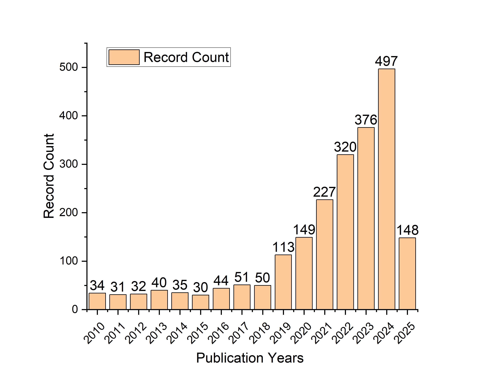

# AI4Polymer 

A curated list of awesome papers, tools, authors, books, blogs and other resources related to AI4Polymer.

Inspired by [awesome-python](https://awesome-python.com) and [awesome-python-chemistry](https://github.com/lmmentel/awesome-python-chemistry).

## Table of contents

- [Awesome AI for polymer](#ai4polymer-)
  - [Publication statistics](#publication-statistics)
  - [Large language model](#large-language-model)
  - [Polymer design](#polymer-design)
  - [Polymer dataset](#polymer-dataset)
  - [Polymer representation](#polymer-representation)
  - [Generative model](#generative-model)
  - [Multi-task learning](#multi-task-learning)
  - [Unsupervised learning](#unsupervised-learning)
  - [Polymer properties prediction](#polymer-properties-prediction)
  - [High-Throughput Screening](#high-throughput-screening)
  - [Bayesian optimization](#bayesian-optimization)
  - [AI4Polymer review](#ai4polymer-review)
  - [AI4Polymer books or chapter](#ai4polymer-books-or-chapter)
  - [Wechat](#个人微信公众号)

## Publication statistics

The retrieve key word is (TI=(polymer* OR macromolecul* OR "polymeric material*" OR "high polymer" OR copolymer* OR biopolymer* OR elastomer*) AND PY=(2010-2025)) AND (AB=("machine learning" OR "deep learning" OR "neural network*") AND PY=(2010-2025)). The access time of web of science is April 22, 2025.

## Large language model

*Paper of using Large language model (LLM) for polymer.*

- [Unified Multimodal Multidomain Polymer Representation for Property Prediction](https://www.researchsquare.com/article/rs-5795287/v1) - A paper of using LLM with Unified Multimodal Multidomain for polymer property prediction.

## Polymer design
- [Functional monomer design for synthetically accessible polymers](https://www.ncbi.nlm.nih.gov/pubmed/39958647) [2025]
- [Benchmarking study of deep generative models for inverse polymer design](http://dx.doi.org/10.1039/D4DD00395K) [2025]
- [Inverse design of copolymers including stoichiometry and chain architecture](https://pubs.rsc.org/en/content/articlelanding/2025/sc/d4sc05900j) [2025]
- [Designing Polymers with Molecular Weight Distribution-Based Machine Learning](https://doi.org/10.1021/jacs.4c16325) [2025]
- [Machine learning applied to the design and optimization of polymeric materials: A review](https://www.sciencedirect.com/science/article/pii/S2949822824003472) [2025]
- [Application of machine learning in polyimide structure design and property regulation](https://journals.sagepub.com/doi/abs/10.1177/09540083251313522) [2025]
- [SPACIER: on-demand polymer design with fully automated all-atom classical molecular dynamics integrated into machine learning pipelines](https://doi.org/10.1038/s41524-024-01492-3) [2025]
- [Design of Tough 3D Printable Elastomers with Human-in-the-Loop Reinforcement Learning](https://chemrxiv.org/engage/chemrxiv/article-details/67ddbe1f81d2151a0257f3e6) [2025] - RL
- [Machine Learning-Aided Inverse Design and Discovery of Novel Polymeric Materials for Membrane Separation](https://doi.org/10.1021/acs.est.4c08298) [2025]
- [Rationally designed high-temperature polymer dielectrics for capacitive energy storage: An experimental and computational alliance](https://doi.org/10.1016/j.progpolymsci.2025.101931) [2025]
- [AI-driven design of fluorine-free polymers for sustainable and high-performance anion exchange membranes](https://www.oaepublish.com/articles/jmi.2024.69) [2025]
- [Deep learning accelerates reverse design of Magnetorheological elastomer](https://www.sciencedirect.com/science/article/pii/S0266353825001162?via%3Dihub#sec2) [2025]
- [AI-guided few-shot inverse design of HDP-mimicking polymers against drug-resistant bacteria](https://doi.org/10.1038/s41467-024-50533-4) [2024]
- [AI-Guided Inverse Design and Discovery of Recyclable Vitrimeric Polymers](https://advanced.onlinelibrary.wiley.com/doi/10.1002/advs.202411385) [2024]
- [On-demand reverse design of polymers with PolyTAO](https://www.nature.com/articles/s41524-024-01466-5#citeas) [2024]
- [Data-Driven Design of Polymer-Based Biomaterials: High-throughput Simulation, Experimentation, and Machine Learning](https://doi.org/10.1021/acsabm.2c00962) [2024]
- [Computational Design of Peptides for Biomaterials Applications](https://doi.org/10.1021/acsabm.2c01023) [2024]
- [Design of functional and sustainable polymers assisted by artificial intelligence](https://doi.org/10.1038/s41578-024-00708-8) [2024]
- [Machine learning-guided discovery of polymer membranes for CO2 separation with genetic algorithm](https://doi.org/10.1016/j.memsci.2024.123169) [2024]
- [Transcend the boundaries: Machine learning for designing polymeric membrane materials for gas separation](https://doi.org/10.1063/5.0205433) [2024]
- [Coarse-Grained Artificial Intelligence for Design of Brush Networks](https://doi.org/10.1021/acsmacrolett.3c00479) [2023]
- [Polymer sequence design via molecular simulation-based active learning](http://dx.doi.org/10.1039/D2SM01193J) [2023]
- [Applied machine learning as a driver for polymeric biomaterials design](https://doi.org/10.1038/s41467-023-40459-8) [2023]
- [Artificial intelligence driven design of catalysts and materials for ring opening polymerization using a domain-specific language](https://doi.org/10.1038/s41467-023-39396-3) [2023]
- [Inverse Design of Complex Block Copolymers for Exotic Self-Assembled Structures Based on Bayesian Optimization](https://doi.org/10.1021/acsmacrolett.3c00020) [2023]
- [Data-Driven Methods for Accelerating Polymer Design](https://doi.org/10.1021/acspolymersau.1c00035) [2022]
- [New Opportunity: Machine Learning for Polymer Materials Design and Discovery](https://doi.org/10.1002/adts.202100565) [2022]
- [Integration of Machine Learning and Coarse-Grained Molecular Simulations for Polymer Materials: Physical Understandings and Molecular Design](https://www.frontiersin.org/journals/chemistry/articles/10.3389/fchem.2021.820417) [2022]
- [Machine Learning on a Robotic Platform for the Design of Polymer–Protein Hybrids](https://doi.org/10.1002/adma.202201809) [2022]
- [Data-driven algorithms for inverse design of polymers](http://dx.doi.org/10.1039/D1SM00725D) [2021]: Review
- [Automation and data-driven design of polymer therapeutics](https://doi.org/10.1016/j.addr.2020.11.009) [2021]
- [Sequence-Engineering Polyethylene–Polypropylene Copolymers with High Thermal Conductivity Using a Molecular-Dynamics-Based Genetic Algorithm](https://doi.org/10.1021/acs.jctc.1c00134) [2021]
- [Targeted sequence design within the coarse-grained polymer genome](https://www.science.org/doi/abs/10.1126/sciadv.abc6216) [2020]
- [Machine-learning-assisted discovery of polymers with high thermal conductivity using a molecular design algorithm](https://www.nature.com/articles/s41524-019-0203-2) [2019]
- [Scoping the polymer genome: A roadmap for rational polymer dielectrics design and beyond](https://doi.org/10.1016/j.mattod.2017.11.021) [2018]

## Properties optimization
- [Machine-Learning-Enhanced Trial-and-Error for Efficient Optimization of Rubber Composites](https://advanced.onlinelibrary.wiley.com/doi/full/10.1002/adma.202407763?casa_token=gxZVHNIKTKIAAAAA%3AoURMnvZMTWKX0zmAWEh9xf912aHiBaq2kxGL4BouuE6UGh6UhwrZMkpQbA3itGj_hPD6Sq93sKlgBt0) [2025]

## Polymer dataset

- [Polyinfo](https://ieeexplore.ieee.org/abstract/document/6076416) - A Japanese website collecting diverse experimental data for polymers from academic papers. PoLyInfo collects information on polymer names, chemical structures, processing methods of samples, measurement conditions, properties, used monomers and polymerization methods.
- PI1M ([PI1M: A Benchmark Database for Polymer Informatics](https://pubs.acs.org/doi/10.1021/acs.jcim.0c00726)) [2020] - A dataset derived from PolyInfo using RNN.
- [Open Macromolecular Genome: Generative Design of Synthetically Accessible Polymers](https://pubs.acs.org/doi/full/10.1021/acspolymersau.3c00003) [2023] - Synthetically accessible polymer with DFT calculated properties.
- [POINT2: A Polymer Informatics Training and Testing Database](https://arxiv.org/abs/2503.23491) [2025]
- [SMiPoly: Generation of a Synthesizable Polymer Virtual Library Using Rule-Based Polymerization Reactions](https://doi.org/10.1021/acs.jcim.3c00329) [2023]
- [Polyuniverse: generation of a large-scale polymer library using rule-based polymerization reactions for polymer informatics](http://dx.doi.org/10.1039/D4DD00196F) [2024]
- [NIMS polymer database PoLyInfo (I): an overarching view of half a million data points](https://doi.org/10.1080/27660400.2024.2354649) [2024]
- [NIMS polymer database PoLyInfo (II): machine-readable standardization of polymer knowledge expression](https://doi.org/10.1080/27660400.2024.2354651) [2024]
- [Estimation of the Flory‐Huggins interaction parameter of polymer‐solvent mixtures using machine learning](https://link.springer.com/article/10.1557/s43579-022-00237-x) [2022] - Flory-Huggins interaction parameter of polymer-solvent mixtures
- [Multitask Machine Learning to Predict Polymer–Solvent Miscibility Using Flory–Huggins Interaction Parameters](https://pubs.acs.org/doi/10.1021/acs.macromol.2c02600) [2023] - Flory-Huggins interaction parameter of polymer-solvent mixtures

## Polymer representation

### Fingerprints or descriptors
- ECFP ([Extended-Connectivity Fingerprints](https://pubs.acs.org/doi/10.1021/ci100050t)) - Extended-connectivity fingerprints (ECFPs) is a class of topological fingerprints for molecular characterization. Historically, topological fingerprints were developed for substructure and similarity searching. Their features represent the presence of particular substructures, allowing easier interpretation of analysis results.
- [Featurization strategies for polymer sequence or composition design by machine learning](http://dx.doi.org/10.1039/D1ME00160D) [2022]
- Mordred ([Mordred: a molecular descriptor calculator](https://doi.org/10.1186/s13321-018-0258-y)) [2018] - Mordred is an open-source tool capable of calculating constitutional descriptors (e.g., molecular weight and atom counts), topological descriptors (information about molecular connectivity and branching), geometrical descriptors (three-dimensional shape and size parameters), electronic descriptors (properties related to electron distribution within the molecule), and physicochemical descriptors (such as solubility parameters and polar surface area).
- [Sizing up feature descriptors for macromolecular machine learning with polymeric biomaterials](https://doi.org/10.1038/s41524-023-01040-5) [2023]

### PSMILES
- [Enhancing Copolymer Property Prediction through the Weighted-Chained-SMILES Machine Learning Framework](https://doi.org/10.1021/acsapm.3c02715) - The authors use weighted-chained-SMILES to represent copolymers.
- Polymer genome ([Machine-learning predictions of polymer properties with Polymer Genome](https://doi.org/10.1063/5.0023759)) [2020] - Heirarchical fingerprints.

### BigSMILES
- [BigSMILES: A Structurally-Based Line Notation for Describing Macromolecules](https://doi.org/10.1021/acscentsci.9b00476) [2019]
- [Is BigSMILES the Friend of Polymer Machine Learning?](https://chemrxiv.org/engage/chemrxiv/article-details/677b61b76dde43c9086fb7f3) [2025]

### GNN
- [QC-Augmented GNNs for Few-Shot Prediction of Amorphous Polymer Properties via Multi-Scale Microstructures](https://chemrxiv.org/engage/chemrxiv/article-details/68085a72e561f77ed45c38ab) [2025]
- [A graph representation of molecular ensembles for polymer property prediction](http://dx.doi.org/10.1039/D2SC02839E) - The authors expand molecular graph representations by incorporating “stochastic” edges to describe the average structure of the repeating unit. In effect, these stochastic edges are bonds weighted by their probability of occurring in the polymer chain. This representation can capture (i) the recurrent nature of polymers' repeating units, (ii) the different topologies and isomerisms of polymer chains, and (iii) their varying monomer composition and stoichiometry.
- [Representing Polymers as Periodic Graphs with Learned Descriptors for Accurate Polymer Property Predictions](https://doi.org/10.1021/acs.jcim.2c00875) - Representing the polymer as a circular graph by linking the head and the tail of the monomer repeating unit.
- [Graph neural networks for materials science and chemistry](https://www.nature.com/articles/s43246-022-00315-6) [2022]: Review

### 3D geometry
- [Uni-mol]

### LLM
- [TransPolymer](https://doi.org/10.1038/s41524-023-01016-5) - A large language model based on RoBERTa architecture for polymer representation and property prediction.
- [PolyBERT](https://doi.org/10.1038/s41467-023-39868-6) - A large language model based on DeBERTa architecture for polymer representation and multi-task property prediction.
- PolyNC ([PolyNC: a natural and chemical language model for the prediction of unified polymer properties](https://pubs.rsc.org/en/content/articlelanding/2024/sc/d3sc05079c)) [2024] - Based on T5 (encoder-decoder architecture).
- [Transferring a Molecular Foundation Model for Polymer Property Predictions](https://doi.org/10.1021/acs.jcim.3c01650) [2024] - Transformer-based.

### Multi-modality
- [Multimodal Transformer for Property Prediction in Polymers](https://doi.org/10.1021/acsami.4c01207) - PSMILES, 2D Graph
- [Mmpolymer: A multimodal multitask pretraining framework for polymer property prediction](https://arxiv.org/abs/2406.04727) - SMILES, 3D geometry
- [Multimodal machine learning with large language embedding model for polymer property prediction](https://arxiv.org/abs/2503.22962) [2025] - PSMILES, 3D geometry (Uni-Mol), LLM (Llama) encodering latent vectors
- [Agentic Mixture-of-Workflows for Multi-Modal Chemical Search]([https://link.springer.com/article/10.1134/S1811238225600041](https://arxiv.org/abs/2502.19629)) [2025]

### Polymer similarity
- [MacroSimGNN: Efficient and Accurate Calculation of Macromolecule Pairwise Similarity via Graph Neural Network](https://chemrxiv.org/engage/chemrxiv/article-details/676575b86dde43c908c95dba) [2024]
- [Calculating Pairwise Similarity of Polymer Ensembles via Earth Mover’s Distance](https://doi.org/10.1021/acspolymersau.3c00029) [2024]
- [Quantifying Pairwise Similarity for Complex Polymers](https://doi.org/10.1021/acs.macromol.3c00761) [2023]

### Multi-domain
- Uni-Poly [Unified Multimodal Multidomain Polymer Representation for Property Prediction](https://www.researchsquare.com/article/rs-5795287/v1) - SMILES, 2D graphs, 3D geometries, Morgan fingerprints and polymer domain-specific textual descriptions.

### Review or benchmarking
- [Evaluating Polymer Representations via Quantifying Structure–Property Relationships](https://doi.org/10.1021/acs.jcim.9b00358)

### Others
- [Ring Repeating Unit: An Upgraded Structure Representation of Linear Condensation Polymers for Property Prediction](https://doi.org/10.1021/acs.jcim.2c01389) [2023]
- [Enhancing deep learning predictive models with HAPPY (Hierarchically Abstracted rePeat unit of PolYmers) representation](https://doi.org/10.1038/s41524-024-01293-8) [2024]

## Generative model
- [PolyConf: Unlocking Polymer Conformation Generation through Hierarchical Generative Models](https://arxiv.org/pdf/2504.08859) [2025] - Masked generative model, SE(3)/SO(3) diffusion model
- [Machine Learning-Driven Discovery of Thermoset Shape Memory Polymers With High Glass Transition Temperature Using Variational Autoencoders](https://onlinelibrary.wiley.com/doi/abs/10.1002/pol.20241095) [2025]: VAE
- [A materials discovery framework based on conditional generative models applied to the design of polymer electrolytes](https://pubs.rsc.org/en/content/articlelanding/2025/dd/d4dd00293h) [2025]: minGPT
- [Property-guided generation of complex polymer topologies using variational autoencoders](https://doi.org/10.1038/s41524-024-01328-0) [2024] - Variational auto-encoder.
- [De novo design of polymer electrolytes using GPT-based and diffusion-based generative models](https://www.nature.com/articles/s41524-024-01470-9) [2024] - GPT, Diffusion model
- [Graph-to-String Variational Autoencoder for Synthetic Polymer Design](https://openreview.net/forum?id=6E2qjEf7Rs) [2023] - NeurlPS 2023, VAE
- [A Large Encoder-Decoder Polymer-Based Foundation Model](https://openreview.net/forum?id=bptYWF8Uy6) [2024] - Encoder-Decoder

## Unsupervised learning
- [PolyCL: contrastive learning for polymer representation learning via explicit and implicit augmentations](https://pubs.rsc.org/en/content/articlelanding/2025/dd/d4dd00236a) [2025] - Contrastive learning
- [Harnessing large language models for data-scarce learning of polymer properties](https://www.nature.com/articles/s43588-025-00768-y) [2025] - Supervised pretraining using dataset synthesized with group-contribution method  
- [Machine Learning Models and Dimensionality Reduction for Prediction of Polymer Properties](https://doi.org/10.1021/acs.macromol.3c02401) [2024] - Dimensionality reduction
- [Unsupervised learning of sequence-specific aggregation behavior for a model copolymer](http://dx.doi.org/10.1039/D1SM01012C) [2021]

## Multi-task learning
- [Gas permeability, diffusivity, and solubility in polymers: Simulation-experiment data fusion and multi-task machine learning](https://www.nature.com/articles/s41524-024-01373-9) [2024]
- [Polymer Informatics at Scale with Multitask Graph Neural Networks](https://doi.org/10.1021/acs.chemmater.2c02991) [2023]
- [Polymer graph neural networks for multitask property learning](https://doi.org/10.1038/s41524-023-01034-3) [2023]
- [Accelerated Scheme to Predict Ring-Opening Polymerization Enthalpy: Simulation-Experimental Data Fusion and Multitask Machine Learning](https://doi.org/10.1021/acs.jpca.3c05870) [2023]

## Transfer learning
- [Thermal stability prediction of copolymerized polyimides via an interpretable transfer learning model](https://www.oaepublish.com/articles/jmi.2024.13) [2024]
- [Understanding Polymers Through Transfer Learning and Explainable AI](https://www.mdpi.com/2076-3417/14/22/10413) [2024]

## Reinforce learning
- [Glass Transition Temperature Prediction of Polymers via Graph Reinforcement Learning](https://pubs.acs.org/doi/full/10.1021/acs.langmuir.4c01906?casa_token=EIhhqO2BNG4AAAAA%3ADWj3_54sEj9F9FE3UKrv67O2y9SPwlpsY8a3zBLVq09W8M1QgJD13yAOeyDw-1qzWCdj1aXq-L7f_wUxew) [2024]

## Polymer properties prediction

### Benchmarking
- [Estimation and Prediction of the Polymers’ Physical Characteristics Using the Machine Learning Models](https://www.mdpi.com/2073-4360/16/1/115) [2024]

### Tg
- [TransTg: a new transformer model for predicting glass transition temperature of polymers from monomers’ molecular structures](https://doi.org/10.1007/s00521-024-10532-4) [2025]
- [Predicting glass transition temperatures for structurally diverse polymers](https://link.springer.com/article/10.1007/s00396-025-05421-8) [2025]
- [Data-Driven Modeling and Design of Sustainable High Tg Polymers](https://www.mdpi.com/1422-0067/26/6/2743) [2025]
- [Large-Scale Glass-Transition Temperature Prediction with an Equivariant Neural Network for Screening Polymers](https://pubs.acs.org/doi/full/10.1021/acsomega.3c06843) [2024]
- [Prediction and Interpretability Study of the Glass Transition Temperature of Polyimide Based on Machine Learning with Quantitative Structure–Property Relationship (Tg-QSPR)](https://pubs.acs.org/doi/full/10.1021/acs.jpcb.4c00756?casa_token=B_j6gRhblYwAAAAA%3A5T1TZNgVDbLYfg1OBiDBDkr0-kT9y5e9wdh86MUGKRbp9I3Qj9d5-IRWNh-DKHJ2Ui1S8LvZpKxMRUM2Ug) [2024]
- [Interpretable Machine Learning Framework to Predict the Glass Transition Temperature of Polymers](https://www.mdpi.com/2073-4360/16/8/1049) [2024]
- [Visual analytics of an interpretable prediction model for the glass transition temperature of fluoroelastomers](https://www.sciencedirect.com/science/article/pii/S2352492824021366) [2024]
- [A glimpse inside materials: Polymer structure – Glass transition temperature relationship as observed by a trained artificial intelligence](https://www.sciencedirect.com/science/article/pii/S0927025624000843?casa_token=KLl3PBQfQdAAAAAA:WsOdj98XrfVKuFXCIGrY24GBi4Q-JujNynnqFTrPbsfHlWpPUzMzLiFEJWVgEuSoe16WDRkX9Zv7) [2024]
- [Benchmarking Machine Learning Models for Polymer Informatics: An Example of Glass Transition Temperature](https://pubs.acs.org/doi/10.1021/acs.jcim.1c01031?ref=PDF) [2021]
- [Machine learning discovery of high-temperature polymers](https://doi.org/10.1016/j.patter.2021.100225) [2021]
- [Machine-Learning-Based Predictive Modeling of Glass Transition Temperatures: A Case of Polyhydroxyalkanoate Homopolymers and Copolymers](https://pubs.acs.org/doi/10.1021/acs.jcim.9b00807) [2019]

### Dielectric properties
- [Recent Progress and Future Prospects on All-Organic Polymer Dielectrics for Energy Storage Capacitors](https://doi.org/10.1021/acs.chemrev.1c00793) [2022] - Review
- [Prediction of polymer properties using infinite chain descriptors (ICD) and machine learning: Toward optimized dielectric polymeric materials](https://onlinelibrary.wiley.com/doi/10.1002/polb.24117) [2016]

### Solubility
- [Data-Driven Prediction of Flory−Huggins Parameter for Quantifying Polymer−Solvent Interaction](https://pubs.acs.org/doi/10.1021/acs.iecr.4c04761) [2025]
- [Predicting homopolymer and copolymer solubility through machine learning](https://pubs.rsc.org/en/content/articlelanding/2024/dd/d4dd00290c) [2025]
- [Recycling of a Polymer Mixture Through Dissolution-Precipitation and Development of Machine Learning Models to Assess Polymer/Solvent Suitability](https://onlinelibrary.wiley.com/doi/10.1002/pol.20241131?af=R) [2025]
- [Ensemble machine learning to accelerate industrial decarbonization: Prediction of Hansen solubility parameters for streamlined chemical solvent selection](https://www.sciencedirect.com/science/article/pii/S2772508124000693?via%3Dihub) [2025]
- [Machine Learning Models for Predicting Polymer Solubility in Solvents across Concentrations and Temperatures](https://doi.org/10.1021/acs.jpcb.4c06500) [2024]
- [Predicting polymer solubility from phase diagrams to compatibility: a perspective on challenges and opportunities](https://pubs.rsc.org/en/content/articlelanding/2024/sm/d4sm00590b) [2024]
- [Cloud point prediction model for polyvinyl alcohol production plants considering process dynamics](https://www.sciencedirect.com/science/article/pii/S2590123024017274) [2024]
- [Solubility of selected polymers in cyclohexane: comparison between Flory-Huggins interaction parameters calculated using three different molecular dynamics simulation approaches](https://pubs.rsc.org/en/Content/ArticleLanding/2024/CP/D4CP03690E) [2024]
- [Multitask Machine Learning to Predict Polymer-Solvent Miscibility Using Flory-Huggins Interaction Parameters](https://pubs.acs.org/doi/10.1021/acs.macromol.2c02600) [2023]
- [Integrating theory with machine learning for predicting polymer solution phase behavior](https://doi.org/10.1016/j.giant.2023.100171) [2023]
- [Easy and fast prediction of green solvents for small molecule donor-based organic solar cells through machine learning](http://dx.doi.org/10.1039/D3CP00177F) [2023]
- [Predicting Multi‐Component Phase Equilibria of Polymers using Approximations to Flory–Huggins Theory](https://onlinelibrary.wiley.com/doi/full/10.1002/mats.202300001) [2023]
- [A Machine Learning Study of Polymer-Solvent Interactions](https://link.springer.com/article/10.1007/s10118-022-2716-2?utm_source=acs&getft_integrator=acs) [2022]
- [Estimation of the Flory-Huggins interaction parameter of polymer-solvent mixtures using machine learning](https://link.springer.com/article/10.1557/s43579-022-00237-x) [2022]
- [Solvent selection for polymers enabled by generalized chemical fingerprinting and machine learning](https://pubs.rsc.org/en/content/articlelanding/2022/cp/d2cp03735a) [2022]
- [Deep learning-based estimation of Flory–Huggins parameter of A–B block copolymers from cross-sectional images of phase-separated structures](https://doi.org/10.1038/s41598-021-91761-8) [2021]
- [Characterization of Polymer-Solvent Interactions and Their Temperature Dependence Using Inverse Gas Chromatography](https://doi.org/10.1021/je00016a024) [1994]: Dataset

### Polymeric membrane
- [Machine learning for the advancement of membrane science and technology: A critical review](https://www.sciencedirect.com/science/article/pii/S0376738824008500) [2025]
- [Machine Learning-Aided Inverse Design and Discovery of Novel Polymeric Materials for Membrane Separation](https://doi.org/10.1021/acs.est.4c08298) [2025]
- [A systematic review of recent advances in the application of machine learning in membrane-based gas separation technologies](https://www.sciencedirect.com/science/article/pii/S030626192402587X?via%3Dihub) [2025]
- [Machine Learning for Polymer Design to Enhance Pervaporation-Based Organic Recovery](https://pubs.acs.org/doi/10.1021/acs.est.4c00060) [2024]
- [Transcend the boundaries: Machine learning for designing polymeric membrane materials for gas separation](https://doi.org/10.1063/5.0205433) [2024]
- [Creation of Polymer Datasets with Targeted Backbones for Screening of High-Performance Membranes for Gas Separation](https://pubs.acs.org/doi/10.1021/acs.jcim.3c01232) [2024]
- [Data-driven predictions of complex organic mixture permeation in polymer membranes](https://doi.org/10.1038/s41467-023-40257-2) [2023]
- [Machine learning enables interpretable discovery of innovative polymers for gas separation membranes](https://www.science.org/doi/10.1126/sciadv.abn9545) [2022]

### Polyimide
- [Application of machine learning in polyimide structure design and property regulation](https://journals.sagepub.com/doi/abs/10.1177/09540083251313522) [2025]
- [Vertical Model for Polyimide Design Assisted by Knowledge-fused Large Language Models](https://chemrxiv.org/engage/chemrxiv/article-details/67d39b74fa469535b9284832) [2025]
- [Data science-centric design, discovery, and evaluation of novel synthetically accessible polyimides with desired dielectric constants](https://pubs.rsc.org/en/content/articlehtml/2024/sc/d4sc05000b) [2024]
- [Predicting and screening high-performance polyimide membranes using negative correlation based deep ensemble methods](https://pubs.rsc.org/en/content/articlelanding/2024/ay/d4ay01160k/unauth) [2024]
- [Property Prediction and Structural Feature Extraction of Polyimide Materials Based on Machine Learning](https://pubs.acs.org/doi/10.1021/acs.jcim.3c00326) [2023]
- [Explainable machine learning for unraveling solvent effects in polyimide organic solvent nanofiltration membranes](https://doi.org/10.1016/j.advmem.2023.100061) [2023]
- [Improved artificial neural networks (ANNs) for predicting the gas separation performance of polyimides](https://doi.org/10.1016/j.memsci.2023.121765) [2023]
- [Machine-Learning-Enabled Framework in Engineering Plastics Discovery: A Case Study of Designing Polyimides with Desired Glass-Transition Temperature](https://doi.org/10.1021/acsami.3c05376) [2023]
- [Designing sulfonated polyimide-based fuel cell polymer electrolyte membranes using machine learning approaches](https://doi.org/10.1016/j.commatsci.2022.111974) [2023]
- [Predicting Dielectric Constant of Polyimide Composites Using Data-Driven Wavelet Kernel Deep Gaussian Process](https://ieeexplore.ieee.org/document/9775797) [2022]
- [Machine Learning with Enormous “Synthetic” Data Sets: Predicting Glass Transition Temperature of Polyimides Using Graph Convolutional Neural Networks](https://pubs.acs.org/doi/10.1021/acsomega.2c04649) [2022]
- [Thermal conductivity of polydisperse hexagonal BN/polyimide composites: Iterative EMT model and machine learning based on first principles investigation](https://doi.org/10.1016/j.cej.2022.135438) [2022]
- [Hydrothermal polymerization of porous aromatic polyimide networks and machine learning-assisted computational morphology evolution interpretation](https://pubs.rsc.org/en/content/articlelanding/2021/ta/d1ta01253c) [2021]
- [Random forest and multilayer perceptron for predicting the dielectric loss of polyimide nanocomposite films](http://dx.doi.org/10.1039/C7RA04147K) [2017]

### Others
- [Refractive index prediction models for polymers using machine learning](https://pubs.aip.org/aip/jap/article/127/21/215105/566123/Refractive-index-prediction-models-for-polymers) [2020] - Refractive index

## High-Throughput Screening
- [High-Throughput Screening and Prediction of High Modulus of Resilience Polymers Using Explainable Machine Learning](https://doi.org/10.1021/acs.jctc.3c00131) [2023]

## Bayesian optimization
- [Accelerated Development of Novel Biomass-Based Polyurethane Adhesives via Machine Learning](https://www.ncbi.nlm.nih.gov/pubmed/40017372) [2025]
- [https://chemrxiv.org/engage/chemrxiv/article-details/6751263ff9980725cf1b53dd](https://chemrxiv.org/engage/chemrxiv/article-details/6751263ff9980725cf1b53dd) [2025]
- [Physics-constrained multi-objective bayesian optimization to accelerate 3d printing of thermoplastics](https://doi.org/10.1016/j.addma.2024.104204) [2024]

## Physics or chemistry informed neural network/machine learning
- [A physics-enforced neural network to predict polymer melt viscosity](https://doi.org/10.1038/s41524-025-01532-6) [2025]
- [Physics-Informed Neural Networks in Polymers: A Review](https://www.mdpi.com/2073-4360/17/8/1108) [2025]

## Polymer characterization
- [DetectNano: Deep Learning Detection in TEM Images for High-Throughput Polymer Nanostructure Characterization](https://chemrxiv.org/engage/chemrxiv/article-details/67ffa612e561f77ed44880f7) [2025]
- [Machine learning for analyzing atomic force microscopy (AFM) images generated from polymer blends](https://pubs.rsc.org/en/content/articlelanding/2024/dd/d4dd00215f#fn1) [2024] - AFM
- [Machine learning for analyses and automation of structural characterization of polymer materials]( https://doi.org/10.1016/j.progpolymsci.2024.101828) [2024]
- [Molecular Characterization of Polymer Networks](https://www.ncbi.nlm.nih.gov/pubmed/33792299) [2021]

## MD
- [Machine learning-assisted exploration of thermally conductive polymers based on high-throughput molecular dynamics simulations](https://doi.org/10.1016/j.mtphys.2022.100850) [2020]

## Synthesizability
- [SAScore]

## Nature and Science papers
- [Deep learning](https://www.nature.com/articles/nature14539) [2015]: Nature

## AI4Polymer review
- [Machine Learning in Polymer Research](https://doi.org/10.1002/adma.202413695) [2025]
- [Machine Learning Approaches in Polymer Science: Progress and Fundamental for a New Paradigm](https://onlinelibrary.wiley.com/doi/10.1002/smm2.1320) [2025]
- [Ten Problems in Polymer Reactivity Prediction](https://doi.org/10.1021/acs.macromol.4c02582) [2025]
- [Convergence of Artificial Intelligence, Machine Learning, Cheminformatics, and Polymer Science in Macromolecules](https://doi.org/10.1021/acs.macromol.4c01704) [2024]
- [Artificial Intelligence for Conjugated Polymers](https://doi.org/10.1021/acs.chemmater.3c02358) [2024]
- [A review on machine learning-guided design of energy materials](https://dx.doi.org/10.1088/2516-1083/ad7220) [2024]
- [Application of Digital Methods in Polymer Science and Engineering](https://doi.org/10.1002/adfm.202309844) [2024]
- [Emerging Trends in Machine Learning: A Polymer Perspective](https://pubs.acs.org/doi/10.1021/acspolymersau.2c00053) [2023]
- [The Rise of Machine Learning in Polymer Discovery](https://doi.org/10.1002/aisy.202200243) [2023]
- [Machine learning for polymeric materials: an introduction](https://doi.org/10.1002/pi.6345) [2022]
- [Polymer informatics: Current status and critical next steps](https://www.sciencedirect.com/science/article/abs/pii/S0927796X2030053X) [2021]
- [Machine learning in polymer informatics](https://doi.org/10.1002/inf2.12167) [2021]
- [Polymer Informatics: Opportunities and Challenges](https://doi.org/10.1021/acsmacrolett.7b00228) [2017]

## AI4Polymer books or chapters
- [AI Application Potential and Prospects in Materials Science: A Focus on Polymers](https://www.okipublishing.com/book/index.php/okip/catalog/book/62) [2025]
- [Polymer Property Prediction Using Machine Learning](https://link.springer.com/chapter/10.1007/978-3-031-78724-9_5) [2025]
- [Applications of Predictive Modeling for Polymers](https://link.springer.com/chapter/10.1007/978-3-031-78724-9_6) [2025]
- [Machine Learning for Polymer Informatics](https://pubs.acs.org/doi/10.1021/acsinfocus.7e8007) [2024]

## 个人微信公众号

