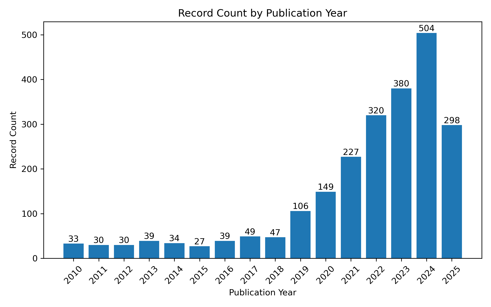

# AI4Polymer&#x20;

A curated collection of resources on AI-driven polymer materials research, covering design, prediction, characterization, and related technologies and literature across the entire workflow.

Inspired by [awesome-python](https://awesome-python.com) and [awesome-python-chemistry](https://github.com/lmmentel/awesome-python-chemistry).

## Table of Contents

*   [Core Domains](#-core-domains)

    *   [Polymer Design and Discovery](#polymer-design-and-discovery)

        *   [Inverse Design](#inverse-design)

        *   [Sustainable Polymers](#sustainable-polymers)

        *   [Targeted Material Design](#targeted-material-design)

        *   [Functional Monomer Design](#functional-monomer-design)

        *   [Copolymer Inverse Design](#copolymer-inverse-design)

        *   [Molecular Weight Distribution-Based Design](#molecular-weight-distribution-based-design)

        *   [Magnetorheological Elastomer Inverse Design](#magnetorheological-elastomer-inverse-design)

        *   [Recyclable Vitrimeric Polymer Design](#recyclable-vitrimeric-polymer-design)

        *   [Peptide Biomaterial Computational Design](#peptide-biomaterial-computational-design)

        *   [Organic Solar Cell Polymer Donor Design](#organic-solar-cell-polymer-donor-design)

        *   [Coarse-Grained AI Design](#coarse-grained-ai-design)

        *   [Polymer Sequence Design (Molecular Simulation-Assisted)](#polymer-sequence-design-molecular-simulation-assisted)

        *   [Catalyst & Ring-Opening Polymerization Material Design](#catalyst--ring-opening-polymerization-material-design)

        *   [Robotic Platform-Assisted Design](#robotic-platform-assisted-design)

        *   [Polymer Therapeutic Automated Design](#polymer-therapeutic-automated-design)

        *   [Copolymer Sequence Engineering (High Thermal Conductivity)](#copolymer-sequence-engineering-high-thermal-conductivity)

        *   [Coarse-Grained Polymer Genome Sequence Design](#coarse-grained-polymer-genome-sequence-design)

        *   [Polymer Genome Planning](#polymer-genome-planning)

    *   [Property Prediction and Characterization](#property-prediction-and-characterization)

        *   [Key Property Prediction](#key-property-prediction)

            *   [Glass Transition Temperature (Tg)](#glass-transition-temperature-tg)

            *   [Dielectric Properties](#dielectric-properties)

            *   [Membrane Performance](#membrane-performance)

            *   [Electrolyte Properties](#electrolyte-properties)

            *   [Solubility](#solubility)

            *   [Polyimide Properties](#polyimide-properties)

            *   [Copolymer Properties](#copolymer-properties)

            *   [Polymer Electrolyte Properties](#polymer-electrolyte-properties)

            *   [Other Properties](#other-properties)

        *   [Characterization Techniques](#characterization-techniques)

    *   [AI Methods and Models](#ai-methods-and-models)

        *   [Machine Learning Models](#machine-learning-models)

            *   [Reinforcement Learning (RL)](#reinforcement-learning-rl)

            *   [Graph Neural Networks (GNN)](#graph-neural-networks-gnn)

            *   [Large Language Models (LLM)](#large-language-models-llm)

            *   [Generative Models](#generative-models)

            *   [Multitask Learning](#multitask-learning)

            *   [Unsupervised Learning](#unsupervised-learning)

            *   [Transfer Learning](#transfer-learning)

            *   [Bayesian Optimization](#bayesian-optimization)

            *   [High-Throughput Screening](#high-throughput-screening)

            *   [Molecular Dynamics (MD)-Assisted Learning](#molecular-dynamics-md-assisted-learning)

            *   [Synthesizability Assessment](#synthesizability-assessment)

        *   [Agent-Based Approaches](#agent-based-approaches)

        *   [Physics-Informed Learning](#physics-informed-learning)

    *   [Data and Tools](#data-and-tools)

        *   [Datasets](#datasets)

        *   [Polymer Representation Methods](#polymer-representation-methods)

            *   [PSMILES](#psmiles)

            *   [BigSMILES](#bigsmiles)

            *   [3D Geometry](#3d-geometry)

            *   [Fingerprints/Descriptors](#fingerprintsdescriptors)

            *   [Hybrid/Multimodal](#hybridmultimodal)

            *   [Other Representations](#other-representations)

            *   [Polymer Similarity](#polymer-similarity)

            *   [Review or Benchmarking](#review-or-benchmarking)

*   [Learning Resources](#-learning-resources)

    *   [Review Articles](#review-articles)

        *   [Recent Reviews](#recent-reviews)

        *   [Classic Reviews](#classic-reviews)

    *   [Books and Chapters](#books-and-chapters)

    *   [Blogs and Tutorials](#blogs-and-tutorials)

    *   [Competitions](#competitions)

    *   [Benchmarking](#benchmarking)

*   [Community and Communication](#-community-and-communication)

    *   [Research Groups](#research-groups)

        *   [International Groups](#international-groups)

        *   [Domestic Groups](#domestic-groups)

    *   [WeChat Official Account](#wechat-official-account)

*   [Publication Statistics](#publication-statistics)

## Publication Statistics

The retrieval keyword is: (TI=(polymer\* OR macromolecul\* OR "polymeric material\*" OR "high polymer" OR copolymer\* OR biopolymer\* OR elastomer\*) AND PY=(2010-2025)) AND (AB=("machine learning" OR "deep learning" OR "neural network\*") AND PY=(2010-2025)).

Access time of Web of Science: July 8, 2025.

## 🎯 Core Domains

### Polymer Design and Discovery

#### Inverse Design

*   [De Novo Design of Polyimides Leveraging Deep Reinforcement Learning Agent](https://advanced.onlinelibrary.wiley.com/doi/10.1002/adma.202511099) \[2025] - Advanced Materials

*   [Inverse Design of Block Polymer Materials with Desired Nanoscale Structure and Macroscale Properties](https://doi.org/10.1021/jacsau.5c00377) \[2025] - JACS Au 5, 2810-2824 (2025)

*   [AI-guided few-shot inverse design of HDP-mimicking polymers against drug-resistant bacteria](https://doi.org/10.1038/s41467-024-50533-4) \[2024]

*   [On-demand reverse design of polymers with PolyTAO](https://www.nature.com/articles/s41524-024-01466-5) \[2024]

*   [Inverse Design of Complex Block Copolymers for Exotic Self-Assembled Structures Based on Bayesian Optimization](https://doi.org/10.1021/acsmacrolett.3c00020) \[2023]

*   [Benchmarking study of deep generative models for inverse polymer design](http://dx.doi.org/10.1039/D4DD00395K) \[2025]

*   [SPACIER: on-demand polymer design with fully automated all-atom classical molecular dynamics integrated into machine learning pipelines](https://doi.org/10.1038/s41524-024-01492-3) \[2025]

*   [Machine Learning-Aided Inverse Design and Discovery of Novel Polymeric Materials for Membrane Separation](https://doi.org/10.1021/acs.est.4c08298) \[2025]

*   [Machine learning-assisted designing of compounds with higher glass transition temperature. Chemical space visualization and synthetic accessibility determination](https://pubs.rsc.org/en/content/articlelanding/2025/nj/d5nj00035a/unauth) \[2025]

#### Sustainable Polymers

*   [Machine Learning for Developing Sustainable Polymers](https://chemistry-europe.onlinelibrary.wiley.com/doi/full/10.1021/chem.202500718) \[2025]

*   [Design of functional and sustainable polymers assisted by artificial intelligence](https://doi.org/10.1038/s41578-024-00708-8) \[2024]

*   [AI-driven design of fluorine-free polymers for sustainable and high-performance anion exchange membranes](https://www.oaepublish.com/articles/jmi.2024.69) \[2025]

#### Targeted Material Design

*   [Machine-learning-assisted discovery of polymers with high thermal conductivity using a molecular design algorithm](https://www.nature.com/articles/s41524-019-0203-2) \[2019]

*   [Advancing organic photovoltaic materials by machine learning-driven design with polymer-unit fingerprints](https://doi.org/10.1038/s41524-025-01608-3) \[2025]

*   [Machine Learning-Aided Inverse Design and Discovery of Novel Polymeric Materials for Membrane Separation](https://doi.org/10.1021/acs.est.4c08298) \[2025]

#### Functional Monomer Design

*   [Functional monomer design for synthetically accessible polymers](https://www.ncbi.nlm.nih.gov/pubmed/39958647) \[2025]

#### Copolymer Inverse Design

*   [Inverse design of copolymers including stoichiometry and chain architecture](https://pubs.rsc.org/en/content/articlelanding/2025/sc/d4sc05900j) \[2025]

#### Molecular Weight Distribution-Based Design

*   [Designing Polymers with Molecular Weight Distribution-Based Machine Learning](https://doi.org/10.1021/jacs.4c16325) \[2025]

#### Magnetorheological Elastomer Inverse Design

*   [Deep learning accelerates reverse design of Magnetorheological elastomer](https://www.sciencedirect.com/science/article/pii/S0266353825001162?via%3Dihub#sec2) \[2025]

#### Recyclable Vitrimeric Polymer Design

*   [AI-Guided Inverse Design and Discovery of Recyclable Vitrimeric Polymers](https://advanced.onlinelibrary.wiley.com/doi/10.1002/advs.202411385) \[2024]

#### Peptide Biomaterial Computational Design

*   [Computational Design of Peptides for Biomaterials Applications](https://doi.org/10.1021/acsabm.2c01023) \[2024]

#### Organic Solar Cell Polymer Donor Design

*   [Designing of potential polymer donors with lower reorganization energy and chemical space exploration in search of materials for efficient organic solar cells](https://www.sciencedirect.com/science/article/abs/pii/S2352492824018610) \[2024]

#### Coarse-Grained AI Design

*   [Coarse-Grained Artificial Intelligence for Design of Brush Networks](https://doi.org/10.1021/acsmacrolett.3c00479) \[2023]

#### Polymer Sequence Design (Molecular Simulation-Assisted)

*   [Polymer sequence design via molecular simulation-based active learning](http://dx.doi.org/10.1039/D2SM01193J) \[2023]

#### Catalyst & Ring-Opening Polymerization Material Design

*   [Artificial intelligence driven design of catalysts and materials for ring opening polymerization using a domain-specific language](https://doi.org/10.1038/s41467-023-39396-3) \[2023]

#### Robotic Platform-Assisted Design

*   [Machine Learning on a Robotic Platform for the Design of Polymer–Protein Hybrids](https://doi.org/10.1002/adma.202201809) \[2022]

#### Polymer Therapeutic Automated Design

*   [Automation and data-driven design of polymer therapeutics](https://doi.org/10.1021/acsabm.2c00962) \[2021]

#### Copolymer Sequence Engineering (High Thermal Conductivity)

*   [Sequence-Engineering Polyethylene–Polypropylene Copolymers with High Thermal Conductivity Using a Molecular-Dynamics-Based Genetic Algorithm](https://doi.org/10.1021/acs.jctc.1c00134) \[2021]

#### Coarse-Grained Polymer Genome Sequence Design

*   [Targeted sequence design within the coarse-grained polymer genome](https://www.science.org/doi/abs/10.1126/sciadv.abc6216) \[2020]

#### Polymer Genome Planning

*   [Scoping the polymer genome: A roadmap for rational polymer dielectrics design and beyond](https://doi.org/10.1016/j.mattod.2017.11.021) \[2018]

### Property Prediction and Characterization

#### Key Property Prediction

##### Glass Transition Temperature (Tg)

*   [Glass Transition Temperature Prediction of Polymers via Graph Reinforcement Learning](https://pubs.acs.org/doi/full/10.1021/acs.langmuir.4c01906) \[2024]

*   [Visual analytics of an interpretable prediction model for the glass transition temperature of fluoroelastomers](https://www.sciencedirect.com/science/article/pii/S2352492824021366) \[2024]

*   [Benchmarking Machine Learning Models for Polymer Informatics: An Example of Glass Transition Temperature](https://pubs.acs.org/doi/10.1021/acs.jcim.1c01031?ref=PDF) \[2021]

*   [TransTg: a new transformer model for predicting glass transition temperature of polymers from monomers’ molecular structures](https://doi.org/10.1007/s00521-024-10532-4) \[2025]

*   [Predicting glass transition temperatures for structurally diverse polymers](https://link.springer.com/article/10.1007/s00396-025-05421-8) \[2025]

*   [Data-Driven Modeling and Design of Sustainable High Tg Polymers](https://www.mdpi.com/1422-0067/26/6/2743) \[2025]

*   [Large-Scale Glass-Transition Temperature Prediction with an Equivariant Neural Network for Screening Polymers](https://pubs.acs.org/doi/full/10.1021/acsomega.3c06843) \[2024]

*   [Prediction and Interpretability Study of the Glass Transition Temperature of Polyimide Based on Machine Learning with Quantitative Structure–Property Relationship (Tg-QSPR)](https://pubs.acs.org/doi/full/10.1021/acs.jpcb.4c00756?casa_token=B_j6gRhblYwAAAAA%3A5T1TZNgVDbLYfg1OBiDBDkr0-kT9y5e9wdh86MUGKRbp9I3Qj9d5-IRWNh-DKHJ2Ui1S8LvZpKxMRUM2Ug) \[2024]

*   [Interpretable Machine Learning Framework to Predict the Glass Transition Temperature of Polymers](https://www.mdpi.com/2073-4360/16/8/1049) \[2024]

*   [A glimpse inside materials: Polymer structure – Glass transition temperature relationship as observed by a trained artificial intelligence](https://www.sciencedirect.com/science/article/pii/S0927025624000843?casa_token=KLl3PBQfQdAAAAAA:WsOdj98XrfVKuFXCIGrY24GBi4Q-JujNynnqFTrPbsfHlWpPUzMzLiFEJWVgEuSoe16WDRkX9Zv7) \[2024]

*   [Machine learning discovery of high-temperature polymers](https://doi.org/10.1016/j.patter.2021.100225) \[2021]

*   [Machine-Learning-Based Predictive Modeling of Glass Transition Temperatures: A Case of Polyhydroxyalkanoate Homopolymers and Copolymers](https://pubs.acs.org/doi/10.1021/acs.jcim.9b00807) \[2019]

*   [Machine Learning-Driven Discovery of Thermoset Shape Memory Polymers With High Glass Transition Temperature Using Variational Autoencoders](https://onlinelibrary.wiley.com/doi/abs/10.1002/pol.20241095) \[2025] - VAE

##### Dielectric Properties

*   [Generating High-Temperature Polymer Dielectrics with a Graph Convolution and Reinforcement Learning Framework](https://doi.org/10.1021/acs.jpcc.5c02310) \[2025]

*   [Rationally designed high-temperature polymer dielectrics for capacitive energy storage: An experimental and computational alliance](https://doi.org/10.1016/j.progpolymsci.2025.101931) \[2025]

*   [Recent Progress and Future Prospects on All-Organic Polymer Dielectrics for Energy Storage Capacitors](https://doi.org/10.1021/acs.chemrev.1c00793) \[2022] - Review

*   [Dielectric Polymer Property Prediction Using Recurrent Neural Networks with Optimizations](https://pubs.acs.org/doi/10.1021/acs.jcim.0c01366) - RNN, Journal of Chemical Information and Modeling 61, 2175-2186 (2021)

*   [Prediction of polymer properties using infinite chain descriptors (ICD) and machine learning: Toward optimized dielectric polymeric materials](https://onlinelibrary.wiley.com/doi/10.1002/polb.24117) \[2016]

*   [AI-assisted discovery of high-temperature dielectrics for energy storage](https://doi.org/10.1038/s41467-024-50413-x) \[2024]

*   [High-temperature polymer composite capacitors with high energy density designed via machine learning](https://www.nature.com/articles/s41560-025-01863-0) \[2025] - Nature Energy (2025), EGNN

*   [Designing tailored combinations of structural units in polymer dielectrics for high-temperature capacitive energy storage](https://www.nature.com/articles/s41467-023-38145-w) \[2023]

##### Membrane Performance

*   [Transcend the boundaries: Machine learning for designing polymeric membrane materials for gas separation](https://doi.org/10.1063/5.0205433) \[2024]

*   [Machine learning enables interpretable discovery of innovative polymers for gas separation membranes](https://www.science.org/doi/10.1126/sciadv.abn9545) \[2022]

*   [Machine learning-guided discovery of polymer membranes for CO₂ separation with genetic algorithm](https://doi.org/10.1016/j.memsci.2024.123169) \[2024]

*   [Gas permeability, diffusivity, and solubility in polymers: Simulation-experiment data fusion and multi-task machine learning](https://www.nature.com/articles/s41524-024-01373-9) \[2024]

*   [Machine learning for the advancement of membrane science and technology: A critical review](https://www.sciencedirect.com/science/article/pii/S0376738824008500) \[2025]

*   [A systematic review of recent advances in the application of machine learning in membrane-based gas separation technologies](https://www.sciencedirect.com/science/article/pii/S030626192402587X?via%3Dihub) \[2025]

*   [Machine Learning for Polymer Design to Enhance Pervaporation-Based Organic Recovery](https://pubs.acs.org/doi/10.1021/acs.est.4c00060) \[2024]

*   [Creation of Polymer Datasets with Targeted Backbones for Screening of High-Performance Membranes for Gas Separation](https://pubs.acs.org/doi/10.1021/acs.jcim.3c01232) \[2024]

*   [Data-driven predictions of complex organic mixture permeation in polymer membranes](https://doi.org/10.1038/s41467-023-40257-2) \[2023]

##### Electrolyte Properties

*   [Deep learning prediction of ionic conductivity in polymer electrolytes using hierarchical polymer graphs](https://linkinghub.elsevier.com/retrieve/pii/S1385894725076673) \[2025]

*   [Machine-Learning-Guided Screening of Advantageous Solvents for Solid Polymer Electrolytes in Lithium Metal Batteries](https://pubs.acs.org/doi/10.1021/acs.nanolett.5c00797) \[2025]

*   [De novo design of polymer electrolytes using GPT-based and diffusion-based generative models](https://www.nature.com/articles/s41524-024-01470-9) \[2024] - GPT & Diffusion model

*   [A materials discovery framework based on conditional generative models applied to the design of polymer electrolytes](https://pubs.rsc.org/en/content/articlelanding/2025/dd/d4dd00293h) \[2025] - minGPT

##### Solubility

*   [Directed Message Passing Neural Networks for Accurate Prediction of Polymer-Solvent Interaction Parameters](https://chemrxiv.org/engage/chemrxiv/article-details/680899bc50018ac7c5bd6fe6) \[2025] - DMPNN

*   [Polymer Solubility Prediction Using Large Language Models](https://pubs.acs.org/doi/full/10.1021/acsmaterialslett.5c00054) \[2025] - LLM, GPT3.5

*   [Data-Driven Prediction of Flory−Huggins Parameter for Quantifying Polymer−Solvent Interaction](https://pubs.acs.org/doi/10.1021/acs.iecr.4c04761) \[2025]

*   [Predicting homopolymer and copolymer solubility through machine learning](https://pubs.rsc.org/en/content/articlelanding/2024/dd/d4dd00290c) \[2025]

*   [Recycling of a Polymer Mixture Through Dissolution-Precipitation and Development of Machine Learning Models to Assess Polymer/Solvent Suitability](https://onlinelibrary.wiley.com/doi/10.1002/pol.20241131?af=R) \[2025]

*   [Ensemble machine learning to accelerate industrial decarbonization: Prediction of Hansen solubility parameters for streamlined chemical solvent selection](https://www.sciencedirect.com/science/article/pii/S2772508124000693?via%3Dihub) \[2025]

*   [Machine Learning Models for Predicting Polymer Solubility in Solvents across Concentrations and Temperatures](https://doi.org/10.1021/acs.jpcb.4c06500) \[2024]

*   [Predicting polymer solubility from phase diagrams to compatibility: a perspective on challenges and opportunities](https://pubs.rsc.org/en/content/articlelanding/2024/sm/d4sm00590b) \[2024]

*   [Cloud point prediction model for polyvinyl alcohol production plants considering process dynamics](https://www.sciencedirect.com/science/article/pii/S2590123024017274) \[2024]

*   [Solubility of selected polymers in cyclohexane: comparison between Flory-Huggins interaction parameters calculated using three different molecular dynamics simulation approaches](https://pubs.rsc.org/en/Content/ArticleLanding/2024/CP/D4CP03690E) \[2024]

*   [Multitask Machine Learning to Predict Polymer–Solvent Miscibility Using Flory–Huggins Interaction Parameters](https://pubs.acs.org/doi/10.1021/acs.macromol.2c02600) \[2023]

*   [Integrating theory with machine learning for predicting polymer solution phase behavior](https://doi.org/10.1016/j.giant.2023.100171) \[2023]

*   [Easy and fast prediction of green solvents for small molecule donor-based organic solar cells through machine learning](http://dx.doi.org/10.1039/D3CP00177F) \[2023]

*   [Predicting Multi‐Component Phase Equilibria of Polymers using Approximations to Flory–Huggins Theory](https://onlinelibrary.wiley.com/doi/full/10.1002/mats.202300001) \[2023]

*   [A Machine Learning Study of Polymer-Solvent Interactions](https://link.springer.com/article/10.1007/s10118-022-2716-2?utm_source=acs\&getft_integrator=acs) \[2022]

*   [Estimation of the Flory-Huggins interaction parameter of polymer-solvent mixtures using machine learning](https://link.springer.com/article/10.1557/s43579-022-00237-x) \[2022]

*   [Solvent selection for polymers enabled by generalized chemical fingerprinting and machine learning](https://pubs.rsc.org/en/content/articlelanding/2022/cp/d2cp03735a) \[2022]

*   [Deep learning-based estimation of Flory–Huggins parameter of A–B block copolymers from cross-sectional images of phase-separated structures](https://doi.org/10.1038/s41598-021-91761-8) \[2021]

*   [A review of polymer dissolution](https://www.sciencedirect.com/science/article/abs/pii/S0079670003000455?via%3Dihub) \[2003] - Review

*   [Characterization of Polymer-Solvent Interactions and Their Temperature Dependence Using Inverse Gas Chromatography](https://doi.org/10.1021/je00016a024) \[1994] - Dataset

*   [Solubility parameters](https://pubs.acs.org/doi/abs/10.1021/cr60298a003?ref=PDF) \[1975] - Review

##### Polyimide Properties

*   [Application of machine learning in polyimide structure design and property regulation](https://journals.sagepub.com/doi/abs/10.1177/09540083251313522) \[2025]

*   [Vertical Model for Polyimide Design Assisted by Knowledge-fused Large Language Models](https://chemrxiv.org/engage/chemrxiv/article-details/67d39b74fa469535b9284832) \[2025]

*   [Data science-centric design, discovery, and evaluation of novel synthetically accessible polyimides with desired dielectric constants](https://pubs.rsc.org/en/content/articlehtml/2024/sc/d4sc05000b) \[2024]

*   [Predicting and screening high-performance polyimide membranes using negative correlation based deep ensemble methods](https://pubs.rsc.org/en/content/articlelanding/2024/ay/d4ay01160k/unauth) \[2024]

*   [Multi-property prediction and high-throughput screening of polyimides: An application case for interpretable machine learning](https://www.sciencedirect.com/science/article/abs/pii/S003238612400939X) \[2024]

*   [Accelerating Discovery of Polyimides with Intrinsic Microporosity for Membrane-Based Gas Separation: Synergizing Physics-Informed Performance Metrics and Active Learning](https://advanced.onlinelibrary.wiley.com/doi/full/10.1021/adfm.202314683) \[2024]

*   [Heat-Resistant Polymer Discovery by Utilizing Interpretable Graph Neural Network with Small Data](https://pubs.acs.org/doi/10.1021/acs.macromol.4c00508) \[2024]

*   [Predicting and screening high-performance polyimide membranes using negative correlation based deep ensemble methods](https://pubs.rsc.org/en/content/articlelanding/2024/ay/d4ay01160k) \[2024]

*   [Property Prediction and Structural Feature Extraction of Polyimide Materials Based on Machine Learning](https://pubs.acs.org/doi/10.1021/acs.jcim.3c00326) \[2023]

*   [Explainable machine learning for unraveling solvent effects in polyimide organic solvent nanofiltration membranes](https://doi.org/10.1016/j.advmem.2023.100061) \[2023]

*   [Improved artificial neural networks (ANNs) for predicting the gas separation performance of polyimides](https://doi.org/10.1016/j.memsci.2023.121765) \[2023]

*   [Machine-Learning-Enabled Framework in Engineering Plastics Discovery: A Case Study of Designing Polyimides with Desired Glass-Transition Temperature](https://doi.org/10.1021/acsami.3c05376) \[2023]

*   [Designing sulfonated polyimide-based fuel cell polymer electrolyte membranes using machine learning approaches](https://doi.org/10.1016/j.commatsci.2022.111974) \[2023]

*   [Discovery of multi-functional polyimides through high-throughput screening using explainable machine learning](https://doi.org/10.1016/j.cej.2023.142949) \[2023]

*   [High-temperature energy storage polyimide dielectric materials: polymer multiple-structure design](https://www.sciencedirect.com/science/article/abs/pii/S2468606922002751) \[2023]

*   [Design of polyimides with targeted glass transition temperature using a graph neural network](https://pubs.rsc.org/en/content/articlelanding/2023/tc/d2tc05174e) \[2023]

*   [Predicting Dielectric Constant of Polyimide Composites Using Data-Driven Wavelet Kernel Deep Gaussian Process](https://ieeexplore.ieee.org/document/9775797) \[2022]

*   [Machine Learning with Enormous “Synthetic” Data Sets: Predicting Glass Transition Temperature of Polyimides Using Graph Convolutional Neural Networks](https://pubs.acs.org/doi/10.1021/acsomega.2c04649) \[2022]

*   [Thermal conductivity of polydisperse hexagonal BN/polyimide composites: Iterative EMT model and machine learning based on first principles investigation](https://doi.org/10.1016/j.cej.2022.135438) \[2022]

*   [Hydrothermal polymerization of porous aromatic polyimide networks and machine learning-assisted computational morphology evolution interpretation](https://pubs.rsc.org/en/content/articlelanding/2021/ta/d1ta01253c) \[2021]

*   [Determination of glass transition temperature of polyimides from atomistic molecular dynamics simulations and machine-learning algorithms](https://doi.org/10.1002/pol.20200050) \[2020]

*   [Accelerated Discovery of High-Refractive-Index Polyimides via First-Principles Molecular Modeling, Virtual High-Throughput Screening, and Data Mining](https://doi.org/10.1021/acs.jpcc.9b01147) \[2019]

*   [Random forest and multilayer perceptron for predicting the dielectric loss of polyimide nanocomposite films](http://dx.doi.org/10.1039/C7RA04147K) \[2017]

##### Copolymer Properties

*   [Radical Reactivity Ratio Predictions for Copolymers with an Interpretable Machine Learning Model](https://chemrxiv.org/engage/chemrxiv/article-details/6859a1d03ba0887c332f55a8) - ChemArxiv, 2025

##### Polymer Electrolyte Properties

*   [PVDF-based solid polymer electrolytes for lithium-ion batteries: strategies in composites, blends, dielectric engineering, and machine learning approaches](http://dx.doi.org/10.1039/D5RA02951A) \[2025] - RSC Advances 15, 20629-20656 (2025)

##### Other Properties

*   [Refractive index prediction models for polymers using machine learning](https://pubs.aip.org/aip/jap/article/127/21/215105/566123/Refractive-index-prediction-models-for-polymers) \[2020] - Refractive index

*   [Machine-Learning-Enhanced Trial-and-Error for Efficient Optimization of Rubber Composites](https://advanced.onlinelibrary.wiley.com/doi/full/10.1002/adma.202407763?casa_token=gxZVHNIKTKIAAAAA%3AoURMnvZMTWKX0zmAWEh9xf912aHiBaq2kxGL4BouuE6UGh6UhwrZMkpQbA3itGj_hPD6Sq93sKlgBt0) \[2025] - Rubber composite optimization

*   [Machine Learning Aided Design of Polymer with Targeted Band Gap Based on DFT Computation](https://doi.org/10.1021/acs.jpcb.0c08674) \[2021] - Band gap

*   [Accelerated Scheme to Predict Ring-Opening Polymerization Enthalpy: Simulation-Experimental Data Fusion and Multitask Machine Learning](https://doi.org/10.1021/acs.jpca.3c05870) \[2023] - Ring-opening polymerization enthalpy

*   [Unsupervised learning of sequence-specific aggregation behavior for a model copolymer](http://dx.doi.org/10.1039/D1SM01012C) \[2021] - Copolymer aggregation behavior

#### Characterization Techniques

*   [DetectNano: Deep Learning Detection in TEM Images for High-Throughput Polymer Nanostructure Characterization](https://chemrxiv.org/engage/chemrxiv/article-details/67ffa612e561f77ed44880f7) \[2025]

*   [Machine learning for analyzing atomic force microscopy (AFM) images generated from polymer blends](https://pubs.rsc.org/en/content/articlelanding/2024/dd/d4dd00215f#fn1) \[2024]

*   [Machine learning for analyses and automation of structural characterization of polymer materials](https://doi.org/10.1016/j.progpolymsci.2024.101828) \[2024]

*   [Molecular Characterization of Polymer Networks](https://www.ncbi.nlm.nih.gov/pubmed/33792299) \[2021]

### AI Methods and Models

#### Machine Learning Models

##### Reinforcement Learning (RL)

*   [Design of Tough 3D Printable Elastomers with Human-in-the-Loop Reinforcement Learning](https://onlinelibrary.wiley.com/doi/10.1002/anie.202513147) \[2025]

*   [De Novo Design of Polymers with Specified Properties Using Reinforcement Learning](https://doi.org/10.1021/acs.macromol.5c00427) \[2025]

*   [Generating High-Temperature Polymer Dielectrics with a Graph Convolution and Reinforcement Learning Framework](https://doi.org/10.1021/acs.jpcc.5c02310) \[2025]

*   [Glass Transition Temperature Prediction of Polymers via Graph Reinforcement Learning](https://pubs.acs.org/doi/full/10.1021/acs.langmuir.4c01906) \[2024]

##### Graph Neural Networks (GNN)

*   [QC-Augmented GNNs for Few-Shot Prediction of Amorphous Polymer Properties](https://chemrxiv.org/engage/chemrxiv/article-details/68085a72e561f77ed45c38ab) \[2025]

*   [QC-Augmented GNNs for Few-Shot Prediction of Amorphous Polymer Properties via Multi-Scale Microstructures](https://chemrxiv.org/engage/chemrxiv/article-details/68085a72e561f77ed45c38ab) \[2025]

*   [A graph representation of molecular ensembles for polymer property prediction](http://dx.doi.org/10.1039/D2SC02839E)

*   [Polymer graph neural networks for multitask property learning](https://doi.org/10.1038/s41524-023-01034-3) \[2023]

*   [Rationalizing Graph Neural Networks with Data Augmentation](https://doi.org/10.1145/3638781) - Environmental augmentation GNN, ACM Trans. Knowl. Discov. Data 18, Article 86 (2024)

*   [Representing Polymers as Periodic Graphs with Learned Descriptors for Accurate Polymer Property Predictions](https://doi.org/10.1021/acs.jcim.2c00875) - Represents polymer as a circular graph by linking monomer repeating unit head and tail

*   [Graph neural networks for materials science and chemistry](https://www.nature.com/articles/s43246-022-00315-6) \[2022] - Review

*   [MacroSimGNN: Efficient and Accurate Calculation of Macromolecule Pairwise Similarity via Graph Neural Network](https://chemrxiv.org/engage/chemrxiv/article-details/676575b86dde43c908c95dba) \[2024]

##### Large Language Models (LLM)

*   [TransPolymer](https://doi.org/10.1038/s41524-023-01016-5) \[2023] - RoBERTa-based polymer characterization model

*   [PolyBERT](https://doi.org/10.1038/s41467-023-39868-6) \[2023] - Multitask property prediction model

*   [PolyNC](https://pubs.rsc.org/en/content/articlelanding/2024/sc/d3sc05079c) \[2024] - T5-based natural and chemical language model

*   [Unified Multimodal Multidomain Polymer Representation for Property Prediction](https://www.researchsquare.com/article/rs-5795287/v1) - LLM-based multimodal framework

*   [Transferring a Molecular Foundation Model for Polymer Property Predictions](https://doi.org/10.1021/acs.jcim.3c01650) \[2024] - Transformer-based

*   [Harnessing large language models for data-scarce learning of polymer properties](https://www.nature.com/articles/s43588-025-00768-y) \[2025] - Supervised pretraining with synthetic data

*   [Polymer Solubility Prediction Using Large Language Models](https://pubs.acs.org/doi/full/10.1021/acsmaterialslett.5c00054) \[2025] - LLM, GPT3.5

##### Generative Models

*   [Property-guided generation of complex polymer topologies using variational autoencoders](https://doi.org/10.1038/s41524-024-01328-0) \[2024] - Variational autoencoder

*   [De novo design of polymer electrolytes using GPT-based and diffusion-based generative models](https://www.nature.com/articles/s41524-024-01470-9) \[2024] - GPT & Diffusion model

*   [Graph-to-String Variational Autoencoder for Synthetic Polymer Design](https://openreview.net/forum?id=6E2qjEf7Rs) \[2023] - NeurIPS 2023, VAE

*   [High-temperature polymer composite capacitors with high energy density designed via machine learning](https://www.nature.com/articles/s41560-025-01863-0) \[2025] - Nature Energy (2025), EGNN

*   [PolyConf: Unlocking Polymer Conformation Generation through Hierarchical Generative Models](https://arxiv.org/pdf/2504.08859) \[2025] - Masked generative model, SE(3)/SO(3) diffusion model

*   [Machine Learning-Driven Discovery of Thermoset Shape Memory Polymers With High Glass Transition Temperature Using Variational Autoencoders](https://onlinelibrary.wiley.com/doi/abs/10.1002/pol.20241095) \[2025] - VAE

*   [A materials discovery framework based on conditional generative models applied to the design of polymer electrolytes](https://pubs.rsc.org/en/content/articlelanding/2025/dd/d4dd00293h) \[2025] - minGPT

*   [A Large Encoder-Decoder Polymer-Based Foundation Model](https://openreview.net/forum?id=bptYWF8Uy6) \[2024] - Encoder-Decoder

##### Multitask Learning

*   [Gas permeability, diffusivity, and solubility in polymers: Simulation-experiment data fusion and multi-task machine learning](https://www.nature.com/articles/s41524-024-01373-9) \[2024]

*   [Polymer Informatics at Scale with Multitask Graph Neural Networks](https://doi.org/10.1021/acs.chemmater.2c02991) \[2023]

*   [Polymer graph neural networks for multitask property learning](https://doi.org/10.1038/s41524-023-01034-3) \[2023]

*   [Accelerated Scheme to Predict Ring-Opening Polymerization Enthalpy: Simulation-Experimental Data Fusion and Multitask Machine Learning](https://doi.org/10.1021/acs.jpca.3c05870) \[2023]

*   [Multitask Machine Learning to Predict Polymer–Solvent Miscibility Using Flory–Huggins Interaction Parameters](https://pubs.acs.org/doi/10.1021/acs.macromol.2c02600) \[2023] - Extended Flory-Huggins dataset

##### Unsupervised Learning

*   [PolyCL: contrastive learning for polymer representation learning via explicit and implicit augmentations](https://pubs.rsc.org/en/content/articlelanding/2025/dd/d4dd00236a) \[2025] - Contrastive learning

*   [Harnessing large language models for data-scarce learning of polymer properties](https://www.nature.com/articles/s43588-025-00768-y) \[2025] - Supervised pretraining with synthetic data

*   [Machine Learning Models and Dimensionality Reduction for Prediction of Polymer Properties](https://doi.org/10.1021/acs.macromol.3c02401) \[2024] - Dimensionality reduction

*   [Unsupervised learning of sequence-specific aggregation behavior for a model copolymer](http://dx.doi.org/10.1039/D1SM01012C) \[2021]

##### Transfer Learning

*   [Thermal stability prediction of copolymerized polyimides via an interpretable transfer learning model](https://www.oaepublish.com/articles/jmi.2024.13) \[2024]

*   [Understanding Polymers Through Transfer Learning and Explainable AI](https://www.mdpi.com/2076-3417/14/22/10413) \[2024]

*   [Transferring a Molecular Foundation Model for Polymer Property Predictions](https://doi.org/10.1021/acs.jcim.3c01650) \[2024] - Transformer-based

##### Bayesian Optimization

*   [Accelerated Development of Novel Biomass-Based Polyurethane Adhesives via Machine Learning](https://www.ncbi.nlm.nih.gov/pubmed/40017372) \[2025]

*   [Physics-constrained multi-objective bayesian optimization to accelerate 3D printing of thermoplastics](https://doi.org/10.1016/j.addma.2024.104204) \[2024]

*   [Inverse Design of Complex Block Copolymers for Exotic Self-Assembled Structures Based on Bayesian Optimization](https://doi.org/10.1021/acsmacrolett.3c00020) \[2023]

##### High-Throughput Screening

*   [High-Throughput Screening and Prediction of High Modulus of Resilience Polymers Using Explainable Machine Learning](https://doi.org/10.1021/acs.jctc.3c00131) \[2023]

*   [Machine learning-assisted exploration of thermally conductive polymers based on high-throughput molecular dynamics simulations](https://doi.org/10.1016/j.mtphys.2022.100850) \[2020]

##### Molecular Dynamics (MD)-Assisted Learning

*   [Machine learning-assisted exploration of thermally conductive polymers based on high-throughput molecular dynamics simulations](https://doi.org/10.1016/j.mtphys.2022.100850) \[2020]

*   [SPACIER: on-demand polymer design with fully automated all-atom classical molecular dynamics integrated into machine learning pipelines](https://doi.org/10.1038/s41524-024-01492-3) \[2025]

*   [Solubility of selected polymers in cyclohexane: comparison between Flory-Huggins interaction parameters calculated using three different molecular dynamics simulation approaches](https://pubs.rsc.org/en/Content/ArticleLanding/2024/CP/D4CP03690E) \[2024]

##### Synthesizability Assessment

*   \[SAScore] - Synthesizability scoring tool

*   [Functional monomer design for synthetically accessible polymers](https://www.ncbi.nlm.nih.gov/pubmed/39958647) \[2025]

*   [Open Macromolecular Genome: Generative Design of Synthetically Accessible Polymers](https://pubs.acs.org/doi/full/10.1021/acspolymersau.3c00003) \[2023] - Synthetically accessible polymers with DFT-calculated properties

*   [SMiPoly: Generation of a Synthesizable Polymer Virtual Library Using Rule-Based Polymerization Reactions](https://doi.org/10.1021/acs.jcim.3c00329) \[2023] - Rule-based polymerization reaction-driven synthesizable polymer virtual library

#### Agent-Based Approaches

*   [Introducing PolySea: An LLM-Based Polymer Smart Evolution Agent](https://chemrxiv.org/engage/chemrxiv/article-details/67f8d2d481d2151a02f55516) \[2025] - ChemArxiv

*   [Automated Retrosynthesis Planning of Macromolecules Using Large Language Models and Knowledge Graphs](https://onlinelibrary.wiley.com/doi/10.1002/marc.202500065) \[2025]

*   [Toward Automated Simulation Research Workflow through LLM Prompt Engineering Design](https://pubs.acs.org/doi/10.1021/acs.jcim.4c01653) \[2025]

*   [Agentic Mixture-of-Workflows for Multi-Modal Chemical Search](https://arxiv.org/abs/2502.19629) \[2025]

#### Physics-Informed Learning

*   [A physics-enforced neural network to predict polymer melt viscosity](https://doi.org/10.1038/s41524-025-01532-6) \[2025]

*   [Physics-Informed Neural Networks in Polymers: A Review](https://www.mdpi.com/2073-4360/17/8/1108) \[2025]

*   [Accelerating Discovery of Polyimides with Intrinsic Microporosity for Membrane-Based Gas Separation: Synergizing Physics-Informed Performance Metrics and Active Learning](https://advanced.onlinelibrary.wiley.com/doi/full/10.1021/adfm.202314683) \[2024]

### Data and Tools

#### Datasets

*   [Polymer Data Challenges in the AI Era: Bridging Gaps for Next-Generation Energy Materials](https://arxiv.org/abs/2505.13494) \[2025] - Review of energy materials datasets

*   [Estimation of the Flory‐Huggins interaction parameter of polymer‐solvent mixtures using machine learning](https://link.springer.com/article/10.1557/s43579-022-00237-x) \[2022] - Flory-Huggins parameter dataset

*   [Multitask Machine Learning to Predict Polymer–Solvent Miscibility Using Flory–Huggins Interaction Parameters](https://pubs.acs.org/doi/10.1021/acs.macromol.2c02600) \[2023] - Extended Flory-Huggins dataset

*   [Polyinfo](https://ieeexplore.ieee.org/abstract/document/6076416) - Japanese database collecting polymer experimental data (names, structures, preparation methods, properties)

*   PI1M ([PI1M: A Benchmark Database for Polymer Informatics](https://pubs.acs.org/doi/10.1021/acs.jcim.0c00726)) \[2020] - RNN-derived dataset from PolyInfo

*   [Open Macromolecular Genome: Generative Design of Synthetically Accessible Polymers](https://pubs.acs.org/doi/full/10.1021/acspolymersau.3c00003) \[2023] - Synthetically accessible polymers with DFT-calculated properties

*   [POINT2: A Polymer Informatics Training and Testing Database](https://arxiv.org/abs/2503.23491) \[2025]

*   [SMiPoly: Generation of a Synthesizable Polymer Virtual Library Using Rule-Based Polymerization Reactions](https://doi.org/10.1021/acs.jcim.3c00329) \[2023] - Rule-based polymerization reaction-driven synthesizable polymer virtual library

*   [Polyuniverse: generation of a large-scale polymer library using rule-based polymerization reactions for polymer informatics](http://dx.doi.org/10.1039/D4DD00196F) \[2024] - Large-scale polymer library (rule-based polymerization-driven)

*   [NIMS polymer database PoLyInfo (I): an overarching view of half a million data points](https://doi.org/10.1080/27660400.2024.2354649) \[2024] - NIMS polymer database (>500k data points)

*   [NIMS polymer database PoLyInfo (II): machine-readable standardization of polymer knowledge expression](https://doi.org/10.1080/27660400.2024.2354651) \[2024] - Machine-readable polymer knowledge standardization

*   [Characterization of Polymer-Solvent Interactions and Their Temperature Dependence Using Inverse Gas Chromatography](https://doi.org/10.1021/je00016a024) \[1994] - Polymer-solvent interaction dataset

*   [Creation of Polymer Datasets with Targeted Backbones for Screening of High-Performance Membranes for Gas Separation](https://pubs.acs.org/doi/10.1021/acs.jcim.3c01232) \[2024] - Polymer membrane dataset

#### Polymer Representation Methods

##### PSMILES

*   [Exploring SMILES and BigSMILES: Toward Efficient and Scalable Polymer Representations for Machine Learning](https://doi.org/10.1021/acs.macromol.5c00604) \[2025]

*   [Enhancing Copolymer Property Prediction through the Weighted-Chained-SMILES Machine Learning Framework](https://doi.org/10.1021/acsapm.3c02715)

*   Polymer genome ([Machine-learning predictions of polymer properties with Polymer Genome](https://doi.org/10.1063/5.0023759)) \[2020] - Hierarchical fingerprints

##### BigSMILES

*   [BigSMILES: A Structurally-Based Line Notation for Describing Macromolecules](https://doi.org/10.1021/acscentsci.9b00476) \[2019]

*   [Is BigSMILES the Friend of Polymer Machine Learning?](https://chemrxiv.org/engage/chemrxiv/article-details/677b61b76dde43c9086fb7f3) \[2025]

##### 3D Geometry

*   \[Uni-mol]

*   [Mmpolymer: A multimodal multitask pretraining framework for polymer property prediction](https://arxiv.org/abs/2406.04727) - Integrates SMILES and 3D geometry

*   [Multimodal machine learning with large language embedding model for polymer property prediction](https://arxiv.org/abs/2503.22962) \[2025] - Integrates PSMILES, 3D geometry (Uni-Mol), and LLM embeddings

##### Fingerprints/Descriptors

*   [PolyMetriX: An Ecosystem for Digital Polymer Chemistry](https://chemrxiv.org/engage/chemrxiv/article-details/67e1a4b381d2151a02a20112) \[2025] - Hierarchical featurization

*   [Extended-Connectivity Fingerprints (ECFPs)](https://pubs.acs.org/doi/10.1021/ci100050t) - Topological fingerprints

*   [Sizing up feature descriptors for macromolecular machine learning with polymeric biomaterials](https://doi.org/10.1038/s41524-023-01040-5) \[2023]

*   [Featurization strategies for polymer sequence or composition design by machine learning](http://dx.doi.org/10.1039/D1ME00160D) \[2022]

*   Mordred ([Mordred: a molecular descriptor calculator](https://doi.org/10.1186/s13321-018-0258-y)) \[2018] - Open-source tool for calculating constitutional, topological, geometrical, electronic, and physicochemical descriptors

*   [Polymer genome](https://doi.org/10.1063/5.0023759) \[2020] - Hierarchical fingerprints

##### Hybrid/Multimodal

*   [Multimodal Transformer for Property Prediction in Polymers](https://doi.org/10.1021/acsami.4c01207) \[2024] - Fuses PSMILES and 2D graphs

*   [Multimodal machine learning with large language embedding model for polymer property prediction](https://arxiv.org/abs/2503.22962) \[2025] - Integrates PSMILES, 3D geometry (Uni-Mol), and LLM embeddings

*   [Mmpolymer: A multimodal multitask pretraining framework for polymer property prediction](https://arxiv.org/abs/2406.04727) - SMILES, 3D geometry

*   [Agentic Mixture-of-Workflows for Multi-Modal Chemical Search](https://arxiv.org/abs/2502.19629) \[2025]

*   Uni-Poly [Unified Multimodal Multidomain Polymer Representation for Property Prediction](https://www.researchsquare.com/article/rs-5795287/v1) - SMILES, 2D graphs, 3D geometries, Morgan fingerprints, and polymer domain-specific textual descriptions

##### Other Representations

*   [Ring Repeating Unit: An Upgraded Structure Representation of Linear Condensation Polymers for Property Prediction](https://doi.org/10.1021/acs.jcim.2c01389) \[2023]

*   [Enhancing deep learning predictive models with HAPPY (Hierarchically Abstracted rePeat unit of PolYmers) representation](https://doi.org/10.1038/s41524-024-01293-8) \[2024]

*   [Representing Polymers as Periodic Graphs with Learned Descriptors for Accurate Polymer Property Predictions](https://doi.org/10.1021/acs.jcim.2c00875) \[2022] - Circular graph representation of polymers

##### Polymer Similarity

*   [MacroSimGNN: Efficient and Accurate Calculation of Macromolecule Pairwise Similarity via Graph Neural Network](https://chemrxiv.org/engage/chemrxiv/article-details/676575b86dde43c908c95dba) \[2024]

*   [Calculating Pairwise Similarity of Polymer Ensembles via Earth Mover’s Distance](https://doi.org/10.1021/acspolymersau.3c00029) \[2024]

*   [Quantifying Pairwise Similarity for Complex Polymers](https://doi.org/10.1021/acs.macromol.3c00761) \[2023]

##### Review or Benchmarking

*   [Evaluating Polymer Representations via Quantifying Structure–Property Relationships](https://doi.org/10.1021/acs.jcim.9b00358)

*   [Sizing up feature descriptors for macromolecular machine learning with polymeric biomaterials](https://doi.org/10.1038/s41524-023-01040-5) \[2023]

## 📚 Learning Resources

### Review Articles

#### Recent Reviews

*   [Artificial Intelligence and Multiscale Modeling for Sustainable Biopolymers and Bioinspired Materials](https://advanced.onlinelibrary.wiley.com/doi/10.1002/adma.202416901) \[2025] - Advanced Matarials

*   [Machine learning in polymer science: A new lens for physical and chemical exploration](https://doi.org/10.1016/j.pmatsci.2025.101544) \[2026] - Progress in Materials Science 156, 101544 (2026)

*   [Recent Advances in Machine Learning-Assisted Design and Development of Polymer Materials](https://onlinelibrary.wiley.com/doi/abs/10.1021/chem.202500718) \[2025] - Chemistry – A European Journal 31, e202500718 (2025)

*   [Machine Learning in Polymer Research](https://doi.org/10.1002/adma.202413695) \[2025]

*   [Basic concepts and tools of artificial intelligence in polymer science](https://pubs.rsc.org/en/content/articlelanding/2025/py/d5py00148j) \[2025] - Polymer Chemistry 16, 2457-2470 (2025)

*   [Machine-Learning-Assisted Molecular Design of Innovative Polymers](https://pubs.acs.org/doi/full/10.1021/accountsmr.5c00151) \[2025] - Accounts of Materials Research

*   [Machine learning in constructing structure–property relationships of polymers](https://pubs.aip.org/aip/cpr/article-abstract/6/2/021305/3345579/Machine-learning-in-constructing-structure?redirectedFrom=fulltext) \[2025]

*   [Machine Learning Approaches in Polymer Science: Progress and Fundamental for a New Paradigm](https://onlinelibrary.wiley.com/doi/10.1002/smm2.1320) \[2025]

*   [Ten Problems in Polymer Reactivity Prediction](https://doi.org/10.1021/acs.macromol.4c02582) \[2025]

*   [Convergence of Artificial Intelligence, Machine Learning, Cheminformatics, and Polymer Science in Macromolecules](https://doi.org/10.1021/acs.macromol.4c01704) \[2024]

*   [Artificial Intelligence for Conjugated Polymers](https://doi.org/10.1021/acs.chemmater.3c02358) \[2024]

*   [A review on machine learning-guided design of energy materials](https://dx.doi.org/10.1088/2516-1083/ad7220) \[2024]

*   [Application of Digital Methods in Polymer Science and Engineering](https://doi.org/10.1002/adfm.202309844) \[2024]

*   [Machine learning applied to the design and optimization of polymeric materials: A review](https://www.sciencedirect.com/science/article/pii/S2949822824003472) \[2025]

*   [Data-driven algorithms for inverse design of polymers](http://dx.doi.org/10.1039/D1SM00725D) \[2021] - Review

*   [Graph neural networks for materials science and chemistry](https://www.nature.com/articles/s43246-022-00315-6) \[2022] - Review

*   [A review of polymer dissolution](https://www.sciencedirect.com/science/article/abs/pii/S0079670003000455?via%3Dihub) \[2003] - Review

*   [Solubility parameters](https://pubs.acs.org/doi/abs/10.1021/cr60298a003?ref=PDF) \[1975] - Review

*   [Recent Progress and Future Prospects on All-Organic Polymer Dielectrics for Energy Storage Capacitors](https://doi.org/10.1021/acs.chemrev.1c00793) \[2022] - Review

*   [Machine learning for the advancement of membrane science and technology: A critical review](https://www.sciencedirect.com/science/article/pii/S0376738824008500) \[2025] - Review

*   [A systematic review of recent advances in the application of machine learning in membrane-based gas separation technologies](https://www.sciencedirect.com/science/article/pii/S030626192402587X?via%3Dihub) \[2025] - Review

*   [Physics-Informed Neural Networks in Polymers: A Review](https://www.mdpi.com/2073-4360/17/8/1108) \[2025] - Review

#### Classic Reviews

*   [Polymer informatics: Current status and critical next steps](https://www.sciencedirect.com/science/article/abs/pii/S0927796X2030053X) \[2021]

*   [Machine learning in polymer informatics](https://doi.org/10.1002/inf2.12167) \[2021]

*   [Polymer Informatics: Opportunities and Challenges](https://doi.org/10.1021/acsmacrolett.7b00228) \[2017]

*   [Polymer Genome: A Data-Powered Polymer Informatics Platform for Property Predictions](https://pubs.acs.org/doi/10.1021/acs.jpcc.8b02913) \[2018]

*   [Perspective: Materials informatics and big data: Realization of the “fourth paradigm” of science in materials science](https://pubs.aip.org/aip/apm/article/4/5/053208/121530/Perspective-Materials-informatics-and-big-data) \[2016]

*   [Emerging Trends in Machine Learning: A Polymer Perspective](https://pubs.acs.org/doi/10.1021/acspolymersau.2c00053) \[2023]

*   [The Rise of Machine Learning in Polymer Discovery](https://doi.org/10.1002/aisy.202200243) \[2023]

*   [Machine learning for polymeric materials: an introduction](https://doi.org/10.1002/pi.6345) \[2022]

*   [Data-Driven Materials Innovation and Applications](https://advanced.onlinelibrary.wiley.com/doi/abs/10.1021/adma.202104113) \[2022]

### Books and Chapters

*   [Deep Learning for Polymer Discovery](https://link.springer.com/book/10.1007/978-3-031-84732-5) \[2026] - Springer

*   [AI Application Potential and Prospects in Materials Science: A Focus on Polymers](https://www.okipublishing.com/book/index.php/okip/catalog/book/62) \[2025]

*   [Polymer Property Prediction Using Machine Learning](https://link.springer.com/chapter/10.1007/978-3-031-78724-9_5) \[2025]

*   [Applications of Predictive Modeling for Polymers](https://link.springer.com/chapter/10.1007/978-3-031-78724-9_6) \[2025]

### Blogs and Tutorials

*   [DeepChem Polymer Science](https://deepchem.io/tutorials/an-introduction-to-the-polymers-and-their-representation/) - Introductory tutorials on polymer informatics

### Competitions

*   [Kaggle competition: NeurIPS - Open Polymer Prediction 2025](https://www.kaggle.com/competitions/neurips-open-polymer-prediction-2025)

### Benchmarking

Benchmarking studies play a critical role in evaluating the performance of AI models, polymer representation methods, and property prediction frameworks. They provide standardized datasets, evaluation metrics, and comparative analyses to guide the advancement of AI-driven polymer research.

#### Benchmarking for Polymer Property Prediction

*   [Benchmarking Machine Learning Models for Polymer Informatics: An Example of Glass Transition Temperature](https://pubs.acs.org/doi/10.1021/acs.jcim.1c01031) \[2021] - A foundational benchmark that compares 14 machine learning models (including linear regression, random forest, and neural networks) on predicting Tg using a dataset of 1,168 polymers. Establishes metrics like root-mean-square error (RMSE) and coefficient of determination (R²) for model evaluation.

*   [Evaluating Polymer Representations via Quantifying Structure–Property Relationships](https://doi.org/10.1021/acs.jcim.9b00358) \[2020] - Benchmarks 8 polymer representation methods (e.g., ECFP, Mordred descriptors, polymer genome fingerprints) across 5 property prediction tasks (Tg, density, solubility parameter). Provides guidelines for selecting representations based on data scarcity and property type.

*   [Polymer Informatics at Scale with Multitask Graph Neural Networks](https://doi.org/10.1021/acs.chemmater.2c02991) \[2023] - Benchmarks multitask GNNs against single-task models on a large-scale dataset (100k+ polymers) for 8 properties (e.g., dielectric constant, gas permeability). Demonstrates the advantage of multitask learning in leveraging cross-property correlations.

*   [POINT2: A Polymer Informatics Training and Testing Database](https://arxiv.org/abs/2503.23491) \[2025] - Introduces a benchmark database with 25,000+ curated polymer entries and 12 key properties. Includes split strategies for training/validation/testing (temporal split, scaffold split) to avoid data leakage and ensure model generalizability.

#### Benchmarking for Generative Models in Polymer Design

*   [Benchmarking study of deep generative models for inverse polymer design](http://dx.doi.org/10.1039/D4DD00395K) \[2025] - Compares 6 generative models (VAEs, GANs, diffusion models, GPT-based models) on 3 inverse design tasks (Tg targeting, dielectric constant optimization, membrane selectivity). Evaluates models using synthetic accessibility, property accuracy, and chemical diversity metrics.

*   [A Large Encoder-Decoder Polymer-Based Foundation Model](https://openreview.net/forum?id=bptYWF8Uy6) \[2024] - Benchmarks a transformer-based encoder-decoder model against 4 state-of-the-art generative models on polymer sequence generation and property matching. Uses BLEU score (for sequence similarity) and property RMSE as evaluation criteria.

#### Benchmarking for Polymer Representation Methods

*   [Sizing up feature descriptors for macromolecular machine learning with polymeric biomaterials](https://doi.org/10.1038/s41524-023-01040-5) \[2023] - Benchmarks 12 descriptor sets (including graph-based, fingerprint-based, and domain-specific descriptors) for predicting 7 biomaterial-related properties (e.g., cell adhesion, biodegradation rate). Identifies descriptor sets optimized for biopolymer applications.

*   [MacroSimGNN: Efficient and Accurate Calculation of Macromolecule Pairwise Similarity via Graph Neural Network](https://chemrxiv.org/engage/chemrxiv/article-details/676575b86dde43c908c95dba) \[2024] - Benchmarks GNN-based similarity metrics against traditional methods (Tanimoto coefficient, Earth Mover’s Distance) for polymer clustering and property prediction. Shows improved performance in capturing structural nuances of complex polymers (e.g., copolymers, branched polymers).

## 🌐 Community and Communication

### Research Groups

Research groups dedicated to AI-driven polymer science serve as hubs for innovation, collaboration, and knowledge dissemination. Below is a curated list of leading groups (international and domestic) with a focus on advancing AI-polymer integration.

#### International Groups

*   **Juan J. de Pablo Group** (New York University, USA)

    [Group Website](https://pme.uchicago.edu/group/de-pablo-group) | [Google Scholar](https://scholar.google.com/citations?hl=en\&user=_Q1HH6gAAAAJ\&view_op=list_works\&sortby=pubdate)

    Focus: Molecular modeling of polymers, AI-driven design of block copolymers, and multiscale simulation of polymer self-assembly. Key contributions include developing machine learning frameworks for predicting polymer nanoscale structure.

*   **Zhen-Gang Wang Group** (California Institute of Technology, USA)

    [Group Website](http://zgwlab.che.caltech.edu/) | [Google Scholar](https://scholar.google.com/citations?hl=en\&user=a3ERFZEAAAAJ\&view_op=list_works\&sortby=pubdate)

    Focus: Polymer physics, AI-aided prediction of polymer dynamics, and design of high-performance polymer composites. Known for work on coarse-grained modeling and machine learning for polymer rheology.

*   **Rui Wang Group** (University of California, Berkeley, USA)

    [Group Website](https://tyokokur.github.io/rwgrp/) | [Google Scholar](https://scholar.google.com/citations?hl=en\&user=IdNvgY0AAAAJ\&view_op=list_works\&sortby=pubdate)

    Focus: Polymer simulation, AI-driven optimization of polymer membranes, and data-driven discovery of sustainable polymers. Leads research on integrating molecular dynamics with machine learning for property prediction.

*   **Michael A. Webb Group** (Princeton University, USA)

    [Group Website](https://cbe.princeton.edu/michael-webb) | [Google Scholar](https://scholar.google.com/citations?hl=en\&user=1s9E0_8AAAAJ\&view_op=list_works\&sortby=pubdate)

    Focus: Polymer simulation, machine learning for polymer crystallization, and high-throughput screening of polymeric materials. Contributes to open-source tools for polymer informatics.

*   **Nicholas E. Jackson Group** (University of Illinois Urbana-Champaign, USA)

    [Group Website](https://chemistry.illinois.edu/jacksonn) | [Google Scholar](https://scholar.google.com/citations?hl=en\&user=xFw-Ab0AAAAJ\&view_op=list_works\&sortby=pubdate)

    Focus: AI for materials discovery, inverse design of polymer dielectrics, and machine learning for polymer synthesis planning. Known for work on physics-informed neural networks in polymer science.

*   **Rampi Ramprasad Group** (Georgia Institute of Technology, USA)

    [Group Website](https://ramprasad.mse.gatech.edu/projects/) | [Google Scholar](https://scholar.google.com/citations?hl=en\&user=er8soVgAAAAJ\&view_op=list_works\&sortby=pubdate)

    Focus: Polymer informatics, machine learning for polymer property prediction, and design of energy-efficient polymers. Developed the Polymer Genome database and related AI tools.

*   **Dagmar R. D'hooge Group** (Ghent University, Belgium)

    [Group Website](https://www.lct.ugent.be/people/dagmar-r-dhooge) | [Google Scholar](https://scholar.google.com/citations?hl=zh-CN\&user=qbU_t60AAAAJ\&view_op=list_works\&sortby=pubdate)

    Focus: Polymer simulation and modeling, AI-driven optimization of polymer processing, and design of biodegradable polymers. Collaborates with industry to translate AI research to practical applications.

*   **Tengfei Luo Group** (University of Notre Dame, USA)

    [Group Website](https://monsterlab.nd.edu/) | [Google Scholar](https://scholar.google.com.hk/citations?hl=zh-CN\&user=VIiy6ugAAAAJ\&view_op=list_works\&sortby=pubdate)

    Focus: AI for polymer design, high-throughput experimentation of polymers, and development of sustainable polymer materials. Leads work on human-in-the-loop reinforcement learning for polymer optimization.

*   **Jana M. Weber Group** (Delft University of Technology, Netherlands)

    [Group Website](https://www.tudelft.nl/ewi/over-de-faculteit/afdelingen/intelligent-systems/pattern-recognition-bioinformatics/the-delft-bioinformatics-lab/people/jana-m-weber) | [Google Scholar](https://scholar.google.nl/citations?hl=en\&user=bSZLDNMAAAAJ\&view_op=list_works\&sortby=pubdate)

    Focus: AI for bioscience, machine learning for biopolymer design, and polymer sequence-function relationships. Applies large language models to peptide and protein-polymer hybrid design.

*   **Grace X. Gu** (UCB, USA)

    [Group Website](https://gu.berkeley.edu/) | [Google Scholar](https://scholar.google.com/citations?hl=en&user=IE4UTWAAAAAJ&sortby=pubdate&view_op=list_works&citft=1&email_for_op=223010165%40link.cuhk.edu.cn&gmla=AH8HC4weHiNSLIXTn5PR66x3SmSym5WJQoJS5HD_EL3EZLCyF9WYCeR_rOY1jASe0aG7mN1Qi-rfpv5kjNR6zyw0QE2hGMTm-Jkk7g)

    Focus: AI for biomaterials and 3D printing.

*   **Ying Li Group** (University of Wisconsin-Madison, USA)

    [Group Website](https://pdelab.engr.wisc.edu/) | [Google Scholar](https://scholar.google.com/citations?hl=zh-CN&user=FgYIdZwAAAAJ&view_op=list_works&sortby=pubdate)

    Focus: Integrate machine learning & data science with multiscale/multiphysics modeling to computationally design advanced polymeric materials (for advanced manufacturing, extreme environments, sustainable energy); accelerate materials discovery via AI-driven tools.

#### Domestic Groups (China)

*   **Shiping Zhu Group** (The Chinese University of Hong Kong, Shenzhen)

    [Group Website](https://polygba.cuhk.edu.cn/) | [Google Scholar](https://scholar.google.com.hk/citations?hl=en\&user=BDAOnYsAAAAJ\&view_op=list_works\&sortby=pubdate)

    Focus: Polymer reaction engineering and theory, AI-driven optimization of polymerization processes, and design of functional polymers. Develops machine learning models for predicting polymer molecular weight distribution.

*   **Hanyu Gao Group** (Hong Kong University of Science and Technology)

    [Group Website](https://hanyugao.com/) | [Google Scholar](https://scholar.google.com/citations?user=zL4-oVYAAAAJ\&hl=en)

    Focus: Polymerization kinetic modeling, AI-aided prediction of polymer reaction rates, and design of controlled polymerization systems. Collaborates with chemical companies to optimize industrial polymer synthesis.

*   **Yin-Ning Zhou Group** (Shanghai Jiao Tong University)

    [Group Website](https://scce.sjtu.edu.cn/teachers/1476.html) | [Google Scholar](https://scholar.google.com/citations?hl=zh-CN\&user=d_hn0v8AAAAJ\&view_op=list_works\&sortby=pubdate)

    Focus: Polymer simulation and modeling, AI-driven design of polymer composites, and high-temperature polymer materials. Contributes to physics-informed machine learning for polymer thermal properties.

*   **Jianfeng Li Group** (Fudan University)

    [Group Website](https://polymer.fudan.edu.cn/polymeren/da/19/c31605a383513/page.htm) | [Google Scholar](https://scholar.google.com/citations?hl=zh-CN\&user=QZ7X7aAAAAAJ\&view_op=list_works\&sortby=pubdate)

    Focus: AI for polymer science, inverse design of conjugated polymers, and machine learning for polymer photoelectric properties. Develops generative models for organic solar cell polymer donors.

*   **Zhao-Yan Sun Group** (Chinese Academy of Sciences, Institute of Chemistry)

    [Group Website](http://ps-lab.ciac.cas.cn/rcdw/ylb/201104/t20110401_268181.html) | [ResearchGate](https://www.researchgate.net/profile/Zhao-Yan-Sun/research)

    Focus: AI for polymer

### WeChat Official Account

